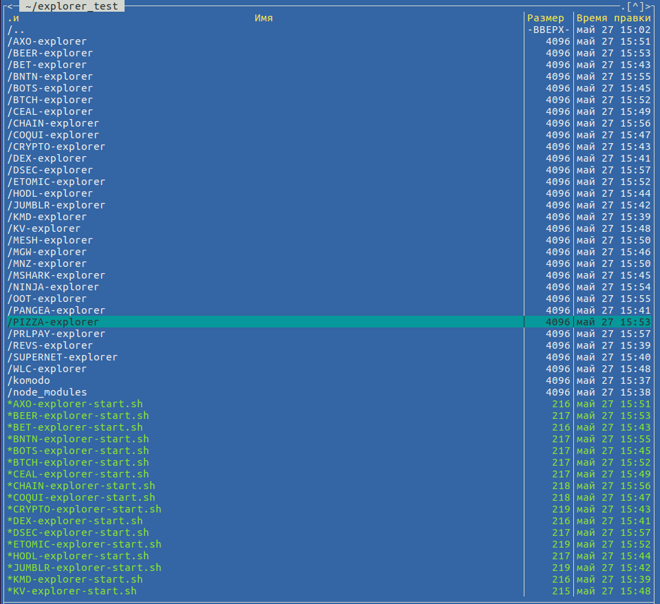

## Komodo Insight Explorer

### Notes

Explorer uses [https://github.com/jl777/komodo](https://github.com/jl777/komodo) **dev** branch komodod (as it already included all needed for bitcore insight: `txindex`, `addressindex`, `timestampindex`,
`spentindex` and zmq support). 

Installation is fully automated, just launch `install-explorer.sh` script from this repo. It will install needed dependencies, download and compile komodod source, install correct version of NodeJS and create KMD and all assets explorer folders and launch scripts.

Also, during installation it will used following node-js modules from this repo:

- bitcore-node-komodo
- bitcore-lib-komodo
- bitcore-build-komodo
- insight-api-komodo
- bitcore-message-komodo
- insight-ui-komodo

Some ideas in installation script taken from [https://github.com/SuperNETorg/komodo-block-explorer](https://github.com/SuperNETorg/komodo-block-explorer) . Thx to @radix42 , @flamingice , @ca333, @satindergrewal and all authors and contributors for their hard work.

### Key features

- Import SSH key to GitHub account **don't** required for install node modules, it will use HTTPS instead of SSH connection to GitHub.
- Errors with `currency.js` and `address.js` are already fixed .
- Display of Notary Node names in "Mined by" section.
- Fixed display of coinbase transactions on mobile devices.
- Fixed block reward display for KMD (it's always 3 KMD).

### How to install?

Installation script was tested on clean installation of Ubuntu 16.04.4 LTS (other OS, like Debian, not tested ... may be it will required some additional dependencies or something else, pull requests and fixes are welcome).

	git clone https://github.com/DeckerSU/komodo-explorers-install explorer
	cd explorer
	./install-explorer.sh
	
If you are get some errors during last install or you break installation process manually - delete `*-explorer`, `node-modules` folders and `*-explorer-start.sh` scripts before launching `./install-explorer.sh` script again.

After `./install-explorer.sh` finished his work you will end up with following directory and files structure:

	node-modules # folder, containing common NodeJS modules
	KMD-explorer # folder for KMD explorer
	REVS-explorer # folder for REVS explorer
	...
	KMD-explorer-start.sh # launch script for KMD explorer
	REVS-explorer-start.sh # launch script for REVS explorer
	...



Corresponding daemons (komodod) for assets will be already started (see last step of ./install-explorer.sh).

After install step is complete run `assets-changes.sh` to change block reward display
for assets to 0.0001 and change assetname in explorer.

### Ports Table

You can get this table on your system using `getports.sh`:

|   | Coin  | RPC port | ZMQ port | Web port | P2P port | Magic (hex) | Magic (dec) |
| - | ------------- | ------------- | ------------- | ------------- | ------------- | ------------- |------------- |
| ✅ | KMD | 8232 | 8332 | 3001 | **7770** | 0x8de4eef9 |  2380590841|
| ✅ | REVS | 8233 (8233) | 8333 | 3002 | 10195 | 0x4141771a | 1094809370 |
| ✅ | SUPERNET | 8234 (8234) | 8334 | 3003 | 11340 | 0xb9112456 | -1190058922 |
| ✅ | DEX | 8235 (8235) | 8335 | 3004 | 11889 | 0x0ace51e0 | 181293536 |
| ✅ | PANGEA | 8236 (8236) | 8336 | 3005 | 14067 | 0x686a3517 | 1751790871 |
| ✅ | JUMBLR | 8237 (8237) | 8337 | 3006 | 15105 | 0x1e45b23a | 507884090 |
| ✅ | BET | 8238 (8238) | 8338 | 3007 | 14249 | 0x07f56179 | 133521785 |
| ✅ | CRYPTO | 8239 (8239) | 8339 | 3008 | 8515 | 0xaaae7cb4 | -1431405388 |
| ✅ | HODL | 8240 (8240) | 8340 | 3009 | 14430 | 0x00cc1675 | 13375093 |
| ✅ | MSHARK | 8241 (8241) | 8341 | 3010 | 8845 | 0x9ef4e9f0 | -1628116496 |
| ✅ | BOTS | 8242 (8242) | 8342 | 3011 | 11963 | 0x042956ec | 69818092 |
| ✅ | MGW | 8243 (8243) | 8343 | 3012 | 12385 | 0xa796157c | -1483336324 |
| ✅ | COQUICASH | 8244 (8244) | 8344 | 3013 | 19711 | 0xd0d1e19f | -791551585 |
| ❎ | WLC | 8245 (8245) | 8345 | 3014 |  | 0x00000000 |  |
| ✅ | KV | 8246 (8246) | 8346 | 3015 | 8298 | 0xc5f134f4 | -974048012 |
| ❎ | CEAL | 8247 (8247) | 8347 | 3016 |  | 0x00000000 |  |
| ✅ | MESH | 8248 (8248) | 8348 | 3017 | 9454 | 0xb6bf6b4d | -1228969139 |
| ❎ | MNZ | 8249 (8249) | 8349 | 3018 |  | 0x00000000 |  |
| ✅ | AXO | 8250 (8250) | 8350 | 3019 | 12926 | 0x179d00ba | 396165306 |
| ✅ | ETOMIC | 8251 (8251) | 8351 | 3020 | 10270 | 0xe8902a07 | -393205241 |
| ✅ | BTCH | 8252 (8252) | 8352 | 3021 | 8799 | 0xff5e1cf4 | -10609420 |
| ❎ | PIZZA | 8253 (8253) | 8353 | 3022 |  | 0x00000000 |  |
| ❎ | BEER | 8254 (8254) | 8354 | 3023 |  | 0x00000000 |  |
| ✅ | NINJA | 8255 (8255) | 8355 | 3024 | 8426 | 0xb26f8eb3 | -1301311821 |
| ✅ | OOT | 8256 (8256) | 8356 | 3025 | 12466 | 0xad4b5ba7 | -1387570265 |
| ❎ | BNTN | 8257 (8257) | 8357 | 3026 |  | 0x00000000 |  |
| ❎ | CHAIN | 8258 (8258) | 8358 | 3027 |  | 0x00000000 |  |
| ❎ | PRLPAY | 8259 (8259) | 8359 | 3028 |  | 0x00000000 |  |
| ❎ | DSEC | 8260 (8260) | 8360 | 3029 |  | 0x00000000 |  |
| ❎ | GLXT | 8261 (8261) | 8361 | 3030 |  | 0x00000000 |  |
| ❎ | EQL | 8262 (8262) | 8362 | 3031 |  | 0x00000000 |  |
| ❎ | VRSC | 8263 (8263) | 8363 | 3032 |  | 0x00000000 |  |
| ✅ | ZILLA | 8264 (8264) | 8364 | 3033 | 10040 | 0x204ddb91 | 541973393 |
| ✅ | RFOX | 8265 (8265) | 8365 | 3034 | 32268 | 0x4406ad4c | 1141288268 |
| ✅ | SEC | 8266 (8266) | 8366 | 3035 | 11539 | 0x8f27938c | -1893231732 |
| ✅ | CCL | 8267 (8267) | 8367 | 3036 | 20848 | 0x66ff315c | 1728000348 |
| ✅ | PIRATE | 8268 (8268) | 8368 | 3037 | 45452 | 0x17b6e058 | 397860952 |
| ❎ | MGNX | 8269 (8269) | 8369 | 3038 |  | 0x00000000 |  |
| ✅ | PGT | 8270 (8270) | 8370 | 3039 | 46704 | 0xc87e0d8c | -931263092 |

### ufw rules

```
    sudo ufw allow 7770/tcp comment 'KMD p2p port'
    sudo ufw allow 10195/tcp comment 'REVS p2p port'
    sudo ufw allow 11340/tcp comment 'SUPERNET p2p port'
    sudo ufw allow 11889/tcp comment 'DEX p2p port'
    sudo ufw allow 14067/tcp comment 'PANGEA p2p port'
    sudo ufw allow 15105/tcp comment 'JUMBLR p2p port'
    sudo ufw allow 14249/tcp comment 'BET p2p port'
    sudo ufw allow 8515/tcp comment 'CRYPTO p2p port'
    sudo ufw allow 14430/tcp comment 'HODL p2p port'
    sudo ufw allow 8845/tcp comment 'MSHARK p2p port'
    sudo ufw allow 11963/tcp comment 'BOTS p2p port'
    sudo ufw allow 12385/tcp comment 'MGW p2p port'
    sudo ufw allow 19711/tcp comment 'COQUICASH p2p port'
    sudo ufw allow 8298/tcp comment 'KV p2p port'
    sudo ufw allow 9454/tcp comment 'MESH p2p port'
    sudo ufw allow 12926/tcp comment 'AXO p2p port'
    sudo ufw allow 10270/tcp comment 'ETOMIC p2p port'
    sudo ufw allow 8799/tcp comment 'BTCH p2p port'
    sudo ufw allow 8426/tcp comment 'NINJA p2p port'
    sudo ufw allow 12466/tcp comment 'OOT p2p port'
    sudo ufw allow 10040/tcp comment 'ZILLA p2p port'
    sudo ufw allow 32268/tcp comment 'RFOX p2p port'
    sudo ufw allow 11539/tcp comment 'SEC p2p port'
    sudo ufw allow 20848/tcp comment 'CCL p2p port'
    sudo ufw allow 45452/tcp comment 'PIRATE p2p port'
    sudo ufw allow 46704/tcp comment 'PGT p2p port'
    # sudo ufw allow from any to any port 3001:3039 proto tcp comment 'allow insight web ports'
```


### Nginx config examples

- **Simple (HTTP only):**

```
	server {
	  listen 80;
	  server_name yourhostname.com;
	
	  root /home/user/insight;
	  access_log /home/user/insight-log/livenet-access.log;
	  error_log /home/user/insight-log/livenet-error.log;
	
	  location / {
	    proxy_pass http://localhost:3001;
	    proxy_http_version 1.1;
	    proxy_set_header Upgrade $http_upgrade;
	    proxy_set_header Connection 'upgrade';
	    proxy_set_header Host $host;
	    proxy_cache_bypass $http_upgrade;
	    proxy_set_header X-Real-IP  $remote_addr;
	    proxy_set_header X-Forwarded-For $remote_addr;
	  }
```	  
	  
- **HTTP + HTTPS + redirect HTTP->HTTPS + rate limiter + Let's Encrypt support**

Run `helper.sh`, your configs examples will be available in `helper/nginx/sites-available `.  

### Related resources

- [Join Komodo Discord](https://komodoplatform.com/discord) #developer channel to get more information.
- Read more about Insight API [here](https://github.com/bitpay/insight-api).
- Read about Web Socket API [here](https://github.com/bitpay/insight-api#web-socket-api).

### Feel free to contribute

Pull requests with logos, color schemes, fixes and any other contributions are welcome.


