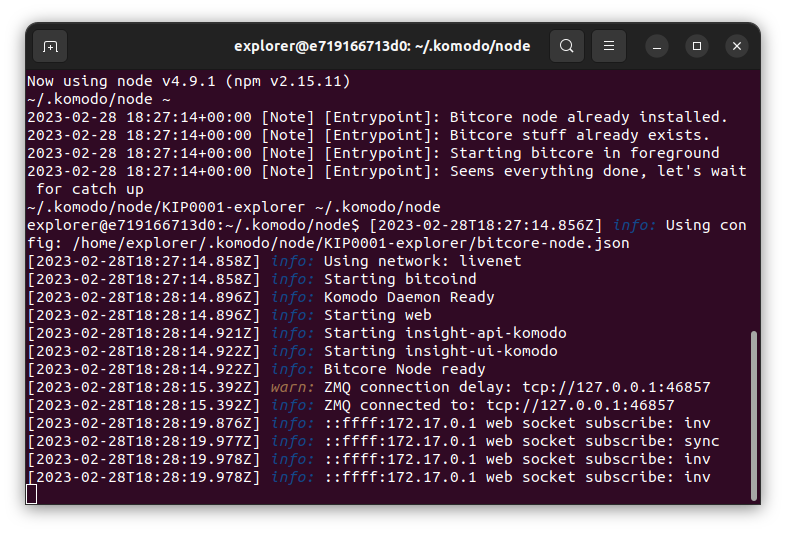

### How to start the explorer with Docker?

Docker feature for launch explorers in in early alpha version. Take this into account before usage.

- To start the explorer with Docker you need to build the container with `docker build -f Dockerfile -t kmdexplorer .` from the directory containing `docker-entrypoint.sh` and `Dockerfile` files. 
- Then you should launch the container with:

```
docker run -v ${PWD}/.zcash-params:/home/explorer/.zcash-params -v ${PWD}/.komodo:/home/explorer/.komodo -e DAEMON_ARGS="-ac_public=1 -ac_name=KIP0001 -ac_supply=139419284 -ac_staked=10" -e WEB_PORT=3002 -p 127.0.0.1:3002:3002 -it kmdexplorer
```

- This will create `.zcash-params` folder and `.komodo` folder in current (!) directory, container will automatically fill it with needed info. All you need is to specify the daemon arguments in `DAEMON_ARGS` environment variable. Currently only assetchains (!) are supported, KMD is untested. Specifying `DAEMON_ARGS` is mandatory.
- After the container starts up and the daemon performs the necessary block checks, bitcore will start:

    

- Bitcore will output everything in stdout and, as the container was launched with `-it`, you are now in an interactive bash shell. To keep the container running in the foreground, press Ctrl-P followed by Ctrl-Q.

#### How to find out the port numbers a coin uses, knowing only its launch arguments?

To find out the port numbers (p2pport and rpcport) a coin uses, knowing only its launch arguments, you can use the `komodo-chainparams` utility - https://hub.docker.com/r/deckersu/komodo-chainparams. Run it as:

```
docker pull deckersu/komodo-chainparams:latest

docker run --rm deckersu/komodo-chainparams:latest <chain_parameters> | jq .
```

For example:

```
docker run --rm deckersu/komodo-chainparams:latest -ac_name=BCZERO -ac_supply=9999999999 -ac_end=1 -ac_public=1 -ac_staked=50 -addnode=65.21.52.182 | jq .
```

And in response you will get something like:

```
{
  "chainname": "BCZERO",
  "magic": 163429333,
  "magic_bytes": "d5bbbd09",
  "magic_hex": "09bdbbd5",
  "p2pport": 45833,
  "rpcport": 45834
}
```

The `p2pport` and `rpcport` values are the port numbers you need.

#### Can you provide a small example of running a specific coin in compose?

Yes, of course:

```yaml
bczero-explorer:
  build:
    context: .
  ports:
    - "45833:45833"
  volumes:
    - ./BCZERO/.zcash-params:/home/explorer/.zcash-params
    - ./BCZERO/.komodo:/home/explorer/.komodo
  environment:
    - WEB_PORT=3002
    - DAEMON_ARGS=-ac_name=BCZERO -ac_supply=9999999999 -ac_end=1 -ac_public=1 -ac_staked=50 -addnode=65.21.52.182
```

 


